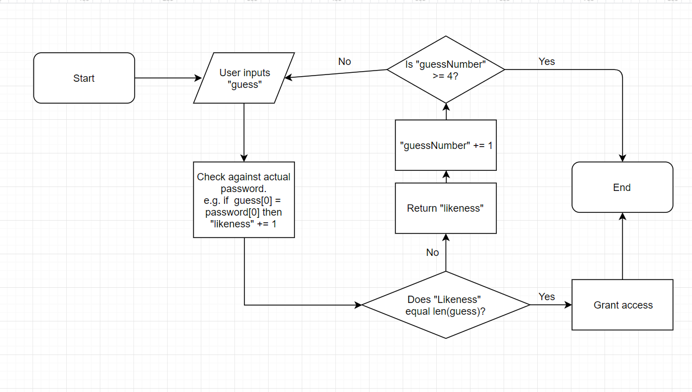

# COMP110 Worksheet 3: Flowcharts and pseudocode

This is the base repository for COMP110 Worksheet 3.

Fork this repository, and edit `README.md` to show your pseudocode solving the worksheet task. Tip: use triple backticks to preserve spacing, e.g.:

```
user input pseudocode

IMPORT random

options = [List of all possible words]

likeness = 0
password = [random.choice(options)] #selects a password at random.
input = [] #appends each character in the user guess as an item in a list.

userInput("Enter a guess of the given length word")
input.append(userInput)
WHILE likeness != length(password): #if likeness equals length of password, the guess must be correct.
	print(likeness)
	userInput("Enter another guess")
	IF likeness lowers in value:
		then character(s) that did not changed is correct.
	ELSEIF likeness raises in value:
		then character(s) that did not change are correct, and new characters are potentially correct.
	ELSEIF likeness stays the same:
		a changed character is now incorrect, but another is now correct.
	ENDIF
	LOOP



```
